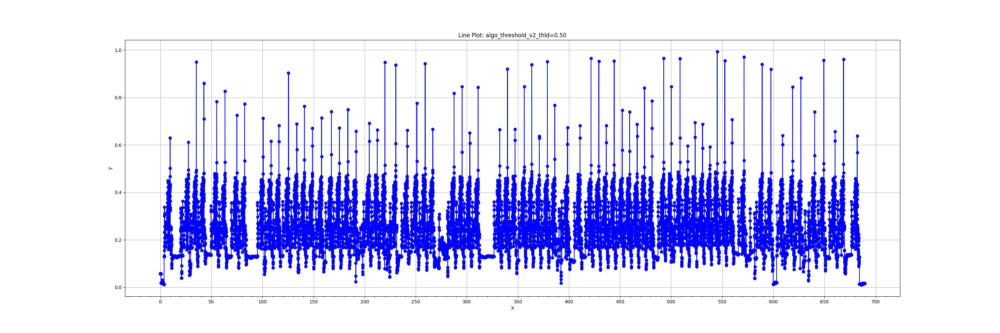
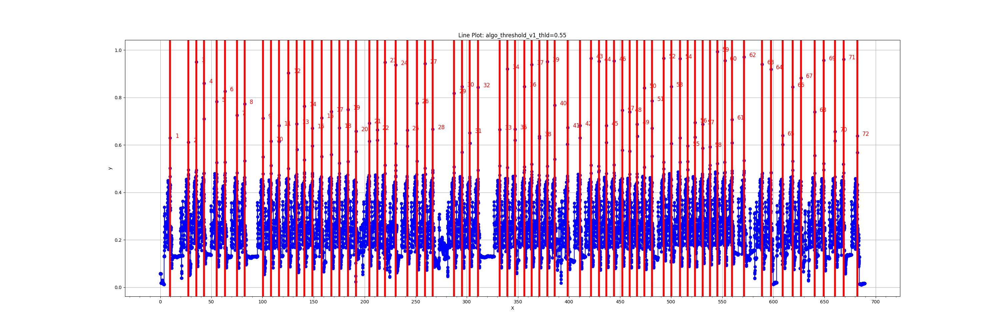

# Apex Finder :)

给定一组分立二元时间序列，找到潜在的尖峰(spike/apex/pulse)

or

Unsupervised pattern recognition in time series

给定一组分立二元时间序列，且已知该序列存在某一种重复的子片段，找到潜在的模式(pattern)

## 原始时间序列


## 红线标记: 潜在的尖峰 spike


## 红线标记: 潜在的模式 pattern


## 使用指南
1. 克隆仓库到本地：
```
git clone https://github.com/SYXiao2002/ApexFinder.git
```

2. 进入项目目录：
```
cd ApexFinder
```

3. 安装依赖（确保已安装Python 3）：
```
python3 -m venv yourVenvName
source yourVenvName/bin/activate
pip install -r requirements.txt
```

4. 运行main
```
python3 main.py
```

## 如何添加新算法
1. 在algo.py定义算法，并添加到algo_l
2. 在main.py的run函数中，具体定义参数


## Useful Link
1. [TSML-Web](https://www.timeseriesclassification.com/index.php)
2. [pyts](https://github.com/johannfaouzi/pyts)
3. [aeon](https://github.com/aeon-toolkit/aeon)